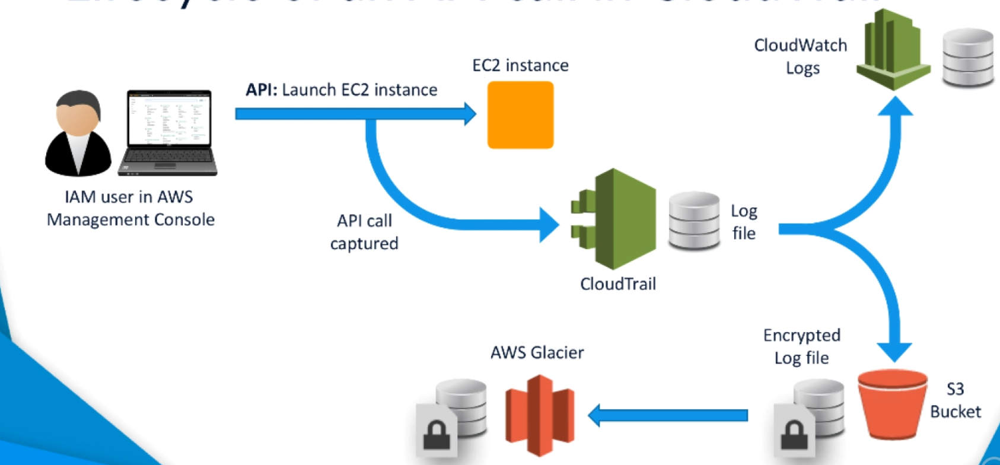
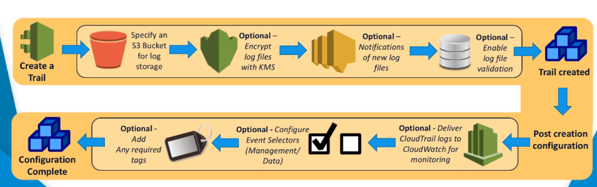
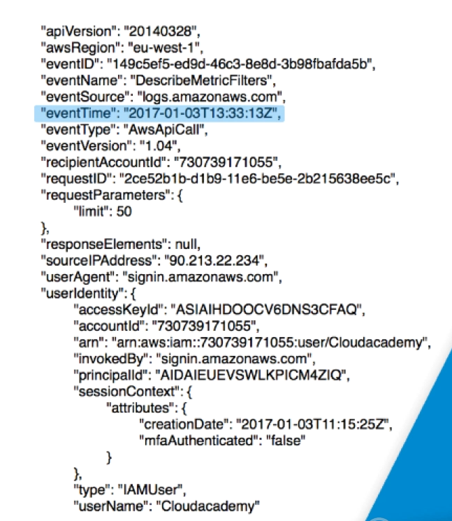

# CloudTrail


[toc]

## Overview


- CloudTrail is a global service supporting all regions
- CloudTrail is by default enabled for all customers
- CloudTrail focuses on auditing API activity
- Records and tracks all Application Programming (API) requests in your AWS Account and records them as **events** in a log file in **S3**
- Requests creating events can be initiated from; SDKs, AWS CLI, AWS Console, another AWS Service. Support for over capturing events from over 60 AWS service and features
- Events contain associated metadata, eg:
  - Identify of the caller
  - Timestamp of the request
  - Source IP address
- Log files are used to store events
  - A new log file is created every 5 minutes containing all the events recorded in that time
  - Log files are created and stored in S3
  - Log files can be stored for as long as you need
- CloudWatch Logs
  - Log files can be delivered to CloudWatch Logs
  - Allows metric monitoring and alerting via SNS
- Log File Validation can be used to ensure log files have not been tampered with since being delivered to S3
-  Encrypted by default with SSE-S3 and the AES 256 algorithm or can be encrypted via KMS if more security is required


##  Lifecycle Of An API Call In CloudTrail





1. An event happens such as an API call
2. CloudTrail is notified of the event and determines if this is an event that requires to be recorded via configured Event Selectors
3. CloudTrail adds the event into the current log file along with metadata
4. The log file is transferred into an S3 bucket
   1. Encrypted by at least SSE or by KMS for extra security if it has been configured
   2. S3 lifecycle rules could transfer the logs into a different S3 storage class or even AWS Glacier
5. The log file can also be transferred into CloudWatch (if configured) and monitored by any configured metrics. This can also trigger alerts such as SNS


## Use Cases

- Security analysis
  - Monitor restricted API calls
  - Notification of threshold breaches
- Resolve day to day operational issues
  - Filtering mechanisms for isolating data
  - Quicker root cause identifications
  - Speedy resolution
- Track changes to your AWS infrastructure
  - Can interact with AWS config as well
- Logs can be used for compliance and governance controls; ISO, PCI DSS, FedRamp


## Core Features and Services

- Trails
  - Create many different trails with many different configurations of what you want to capture
- S3
  - Used by default to store the CloudTrail log files
  - A dedicated S3 bucket is required per trail
- Logs
  - Logs are created by AWS CloudTrail and record all events captured
  - A new log file is created approximately every five minutes and once processed, it is delivered to an S3 bucket  as defined by its trail configuration
  - If no API calls have been made,  then no logs will be delivered
- KMS
  - The use of AWS KMS is an optional element of CloudTrail, but it  allows additional encryption to be added to your log files when stored  on S3
- SNS
  - SNS is also an optional component for CloudTrail, but it allows  for you to create notifications. For example, when a new log file is  delivered to S3, SNS can notify someone or a team via an email. Or it  could be used in conjunction with CloudWatch when metric thresholds have been reached.
- CloudWatch Logs
  - Again, this is another optional component. But AWS  CloudTrail allows you to deliver its logs to AWS CloudWatch logs as well as S3 for specific monitoring metrics to take place
- Event Selectors
  - Event selectors allow you to add a level of  customization to the type of API requests you want the corresponding  trail to capture. These are seen inside the event history panel of the CloudTrail console area
- Tags
  - Tags allow you to assign your own metadata to your trail. For  example, you could add a project or department tag indicating which  project or department the trail relates to
- Events
  - For every API request that is captured by CloudTrail it is recorded as an event in a CloudTrail log file
- API Activity Filters
  - These are search filters that can be applied  against your API activity history in the management console for create,  modify and delete API calls. These events are held in the management  console for seven days, even if the trail itself is stopped or deleted.


## Event Types

- Management events 
  - Logged by default
  - Provide insight into management operations performed on resources in your AWS account, also known as control plane operations
  - These are the global services
  - Anything which is not a data event is a management event
- Data events 
  - Not logged by default
  - Data events provide insight into the resource operations performed on or in a resource, also known as data plane operations
  - Data events are calls to S3 bucket with GET, PUT, DELETE etc
  - Data events are often high-volume activities
- For global services such as IAM, STS, CloudFront, and Route 53, events are delivered to any trail that includes global services, and are logged as occurring in US East (N. Virginia) Region or marled as Apply trail to all regions


## Event Selectors

- An event selector specifies the types of events to log
- A predicate to use to determine if an event is logged
- There are three types of options inside an event selector
  - Read/Write Events
    - Options Read-only, Write-only and All
    - Defaults to All
  - Management events with options Yes and No
    - Defaults to Yes
  - Data events
    - Defaults to off
    - Mandatory if Management events is set to false, otherwise optional
    - Requires a bucket name and optionally a prefix to filter down objects inside the bucket


## Creating A CloudTrail





1. Create a trail
     1. Provide a name
     2. Select if to apply to all regions
        1. If no the trail is created against the region you are currently logged in as and only API calls to that region will be logged
        2. No is the default option when creating via CloudTrail API or the AWS CLI
     3. Specify either a new or existing S3 bucket which will be used to store the CloudWatch logs
     4. Optionally encrypt log files via KMS; by default encryption will be SSE
        1. SSE-S3 is AES-256bit encryption, completely managed by AWS. The keys are managed and rotated without any user interaction
        2. KMS allows more control over your encryption as well as allows providing your own keys.
           1. CloudTrail can use an existing key in KMS or will create a new one for you
     5. Optionally use SNS to notify you when new log files are delivered
        1. Create or select an existing SNS topic to be notified whenever a new log file is delivered
     6. Optionally enable Log File Validation, ensure logs have not been tampered since delivery to S3
2. Additional options are available once a trail has been created
     1. Select to include global services or management logs; defaults to yes
     2. Optionally deliver logs to CloudWatch logs in addition to S3
        1. Create CloudWatch monitoring metrics against specific API calls and will receive notification from SNS when custom thresholds are reached
        2. Can create a new log group or select an existing one
     3. Optionally configure Event Selectors 
        1. At least one event selector is required and it is created by default
        2. Multiple of these event selectors can be added
     4. Optionally tag your trail
        1. Just as per any other AWS you can attach metadata as tags
3. At this point your trail is configured and actively recording API calls  as per your configuration
4. For every API call that matches the  requirement of your trail, it will be captured and recorded in a log  file as an event. Each API call will be recorded as a new event


## Permissions


### CloudTrail Access

- Create your own access policy or use an AWS Managed policy
- Currently AWS has two Managed policies in IAM
  - AWSCloudTrailFullAccess
    - Contains admin level permissions for SNS and S3
    - Full admin rights for everything required to manage CloudTrail
  - AWSCloudTrailReadOnlyAccess
    - Read-only access


### S3 Bucket Permissions

- S3 Bucket selected can either be a new one to be created or an existing one
  - Create a new S3 bucket will mean that CloudTrail applies and configures a Bucket Policy with the relevant permissions
    - Attributes configured by  CloudTrail
      - The allowed  Statement IDs (SIDs)
      - The folder name where the log files will be saved
      - The service principal name for the current and future CloudTrail  supported regions
      - The Bucket name
      - The optional prefix, if one was  specified
        - Allows for better organization by having a tree like structure based upon the trail being logged
      - The ID of the owning account
    - This method is the easiest  way to allow CloudTrail to write logs to your S3 Bucket
  - Selecting an existing bucket would mean you have to set up all the required permissions
    - AWS have template policy you can use
      - https://docs.aws.amazon.com/awscloudtrail/latest/userguide/create-s3-bucket-policy-for-cloudtrail.html#using-an-existing-bucket-for-ct-logs
- For users accessing logs via S3 they will need read permissions via the normal IAM or S3 Bucket Policy or an S3 access control list


### Key Permissions

- If the logs have been encrypted using the Key Management Service
  - Decrypt permission must be given on the Customer Master Key (CMK) Policy
    - Applied automatically if you get CloudTrail to create the key
    - Requires you to apply if you use an existing KMS key
  - The  Key and S3 Bucket must be in the same region
  - AWS have  template policy to apply if you are using an existing key
    - https://docs.aws.amazon.com/awscloudtrail/latest/userguide/default-cmk-policy.html


## Log Files

- Log files are written in JSON
- A new event is written for every API call
- A new log file is created every 5 minutes; if API calls are made and selectors are hit
- Log files are pushed to S3 about 15 minutes after the API call was created
- User agent can be:
  - Signin.amazonaws.com is from  within the AWS Management Console
  - Console.amazonaws.com is by the Root user of the account
  - lambda.amazonaws.com is by an AWS Lambda
- Log file name
  - AccountID_CloudTrail_RegionName_YYYYMMDDTHHmmZ_UniqueString.FileNameFortmat
  - UniqueString is 16 char random and just to ensure logs are not overwritten
  - FileNameFormat is default of json.gz; gziped JSON text file
- Bucket Folder Structure
  - Files are stored in folders on the S3 bucket
  - BucketName/prefix/AWSLogs/AccountID/CloudTrail/RegionName/YYY/MM/DD





## Log Aggregates

- CloudTrail allows aggregating logs from multiple AWS Accounts into the same S3 bucket
- CloudTrail **does not** allow aggregating logs from multiple AWS Accounts into CloudWatch
- Creation Steps
  - Follow the normal process as above in your primary account (where the logs will be written to)
  - When applying the S3 permissions add in an entry for each AWS Account under the resource section of the policy
  - Create trails for the other secondary accounts
    - Other accounts which should log to the primary account
    - Input the name of the bucket; a warning will appear
    - Ensure the same prefix is used between your trails
- Access Steps for secondary 
  - Create roles for each AWS secondary account in your AWS primary account
  - Assign access policy to each role allowing only a specific AWS account access 
  - Users in secondary AWS accounts will need to assume one of these roles for their corresponding AWS account log files
    - Use the sts:AssumeRole action and a resource of the role in the AWS primary account
    - Attach the policy to the required users


## Log File Integrity

- If log file validation is turned on a hash of the log file is created using the SHA-256 algorithm
- A digest file is pushed to the same S3 bucket every hour containing a list of all log files delivered in the last hour along with their hash code
- Stored in the same bucket but a different file
- The digest file is signed by a private key of a public/private key pair
- Folder structure
  - S3-bucket-name/AWSLogs/your-aws-account-id/CloudTrail-Digest/AWSRegionName/digest-end-year/digest-end-month/digest-end-date


```bash
# Verify log against hash
aws cloudtrail validate-logs --trail-arn <trailARN> --start-time <start-time> [--end-time <end-time>] [--s3-bucket <bucket-name>] [--verbose]
```


## Event History


- Event History can be used to find events from log files

- Found within the CloudTrail service from the management console
- API Activity Filters can be used to query events via Event History in CloudTrail

  - View, search, and download the past 90 days of activity in your AWS account
  - Filter by Time range and one of the following attributes: Event name, User name, Resource name, Event source, Event ID, and Resource type


## Monitoring In Cloud Watch


- When selecting create a new CloudWatch log, a default role is created called

  - CloudTrail_CloudWatchLogs_Role

    - The policy requires an action of logs:CreateLogStream and logs:PutLogEvents
- CloudWatch log events have a maximum size limitation of 256KB; any event larger will not be sent by CloudTrail
- Each CloudWatch metric requires a filter pattern to predicate against the incoming events

  - https://docs.aws.amazon.com/AmazonCloudWatch/latest/logs/FilterAndPatternSyntax.html


## Price

- The first copy of management events within each region is delivered free of charge
- Additional copies of management events are charged
- Data events are recorded and charged only for the Lambda functions and S3  buckets you specify
- Once a CloudTrail trail is set up, S3 charges apply based on your usage, since CloudTrail delivers logs to an S3 bucket


## AWS White Paper

AWS have a white paper on logging with CloudTrail for security

- https://d1.awsstatic.com/whitepapers/compliance/AWS_Security_at_Scale_Logging_in_AWS_Whitepaper.pdf?did=wp_card&trk=wp_card


## Sources

- https://docs.aws.amazon.com/awscloudtrail/latest/userguide
- https://aws.amazon.com/blogs/aws/new-amazon-web-services-extends-cloudtrail-to-all-aws-customers
- https://aws.amazon.com/cloudtrail/features
- https://aws.amazon.com/cloudtrail/pricing
- https://aws.amazon.com/cloudtrail/faqs


