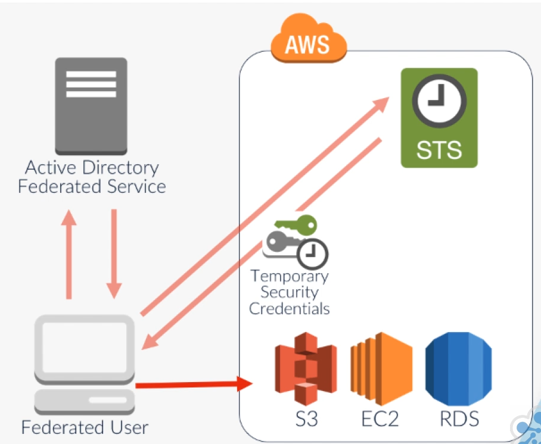

# AWS IAM

[toc]

## Overview

- IAM is the ability to manage, control and govern authentication, authorization and access control mechanisms of identities to your resources within your AWS account
- IAM performs authentication and authorization for everything from for user log in to cross service calls and resource access
  - Authentication is validating your identity
  - Authorization is granting permission for an action
- IAM is a global service; users exist within all regions
- Is made up of the following parts:
  - **Users**

    - Objects within IAM identifying different users
  - **Groups**:
    - Objects that contain multiple users
  - **Roles**:
    - Objects that different identities can adopt to assume a new set of permissions
  - **Policy Permissions**:
    - JSON policies that define what resources can and can't be accessed
  - **Access Control Mechanisms**
    - Mechanisms that govern how a resource is accessed
- The responsibility of implementing secure, robust and tight security within your AWS account using IAM is yours
- The initial dashboard of the IAM console will display information relating to the IAM
  - Sign-in link
  - IAM Resources
    - A summary count of IAM resources using a simple count of the number of users, groups, roles, customer manage policies and identity providers configured
  - Security Status
    - Five best practices AWS IAM recommends and if you have implemented them
      - Activate MFA on your root account, create individual IAM users, use groups to assign permissions, apply an IAM password policy and rotate your access keys


## Users, Groups & Roles


### Users

- Users are objects created to represent an identity; either a real person or an application
- Can be created by in the AWS Console, AWS CLI, PowerShell or the IAM HTTP API
- User name; max 64 characters
- AWS Access Type
  - AWS Management Console Access
    - Requires user name and password
  - Programmatic access
    - Requires an access Key ID and secret access Key ID for the SDK
- Permissions assignment
  - Add user to group
  - Copy permissions from existing user
  - Attach existing policies directly
- After creation you can download the security credentials within a CSV file
  - User name
  - Keys required for programmatic access
  - Console login link
  - Details can also be emailed to the new user, using the send email link


### Access Keys

- Required for programmatic access
- These access keys are comprised of two elements
  - An access key ID
    - 20 random uppercase alphanumeric characters
  - A secret access key ID
    - 40 random upper and lowercase alphanumeric and non-alphanumeric characters
    - Will only be displayed once after creation and can not be retrieved
- These access keys must then be applied and associated your application that you are using
- From the user summary page
  - User ARN, which is the Amazon Resource Name, a unique identifier of the object
  - Permissions or any attached policies that are associated with the user
  - Any group memberships that the user belongs to
  - Details of the security credentials of the user
    - Manage the current password
    - Manage Multi Factor Authentication
    - Manage any signing certificates
      - Used for secure access to certain AWS product interfaces
    - Create new access keys for programmatic access
      - Good practice to rotate and change your access keys periodically
    - Upload SSH public keys for AWS CodeCommit
    - Generate HTTPS Git credentials for AWS CodeCommit
  - Access advisor
    - List of services that the user has permissions
    - Last access time for those services were
  - Best practice to assign permissions to user groups and not users


### Groups

- They are not used in any authentication process
- They are used to authorize access to AWS resources, through the use of AWS Policies
- IAM Groups contain IAM Users
- Will have IAM Policies associated that will allow or explicitly deny access to AWS resources
- These policies are either
  - AWS managed policies, that can be selected from within IAM and are managed by AWS
  - Customer managed policies; policies created and managed by you
- Groups are normally created, that relate to a specific requirement or job role
- Any users that are a member of that group inherit the permissions applied to the group
- By applying permissions to the group instead of individual users, it makes it easy to modify permissions for multiple users at once
-  AWS account has a default maximum limit of a hundred groups; changeable by contacting AWS support
- A user can only be associated to 10 groups


### IAM Roles

- IAM Roles allow a user or AWS services to adopt a set of temporary IAM permissions to access AWS resources
- IAM roles themselves do not have any access keys or credentials associated to them; credentials are dynamically assigned by AWS
- Allow a central place for management and changes are automatically reflected

- There are currently four different types of roles that can be created
  - **AWS Service Role**
    - Used by other services that would assume the role to perform specific functions based on a set of permissions associated with it
    - Some examples of AWS Service Roles would be Amazon EC2, AWS Directory Services, and AWS Lambda
    - Once you have selected your service role, you would then need to attach a policy with the required permissions, and set a role name to complete its creation
  - **AWS Service-Linked Role**
    - These are very specific roles that are associated to certain AWS services
    - They are pre-defined by AWS, and the permissions can't be altered in any way, as they are set to perform a specific function
    - Examples of these AWS Service-Linked Roles are Amazon Lex-Bots, and Amazon Lex-Channels
    - Once you have selected your service-linked role, you simply need to assign it a name and complete the creation
  - **Cross-Account Access**
    - This role type offers two options
      - Providing access between AWS accounts that you own
      - Providing access between an account that you own and a third party AWS account
    - This access is managed by policies that establish trusting and trusted accounts that explicitly allow a trusted principal to access specific resources
    - Many services use roles to allow cross-account access to resources
    - At a high level, these roles are configured as follows
      - The trusting account is the account that has the resources that need to be accessed
      - The trusted account contains the users that need to access the resources in the trusting account
        1. A role is created in the trusting account
        2. A trust is then established with the role by entering the AWS account number of the trusted account
        3. Permissions are then applied to the role via policies
        4. The users in the Trusted account then need to have permissions to allow them to assume the role in the trusting account; uses the sts:AssumeRole action in a policy
        5. These group of users would have a policy attached to the group; the resource field would have the trusting account id
  - **Identity Provider Access**
    - Grant access to web identity providers
      - Creates a trust for users using Amazon Cognito, Amazon, Facebook, Google, or any other open ID connect provider
    - Grant web single sign on to SAML providers
      - Allows access for users coming from a Security Assertion Markup Language (SAML) provider
    - Grant API access to SAML providers
      - Allows access via the AWS CLI, SDKs, or API calls


## IAM Policies

- IAM policies are used to assign permissions to users, groups, and roles
- IAM policies are formatted as JSON documents
- There are two types
  - **Managed Policies**
    - AWS Managed Policies
    - Customer Managed Policies
  - **Inline Policies**
- Elements
  - **Version** specifies the policy language version (eg: 2012-10-17)
  - **Statement** is the main element of the policy which includes (Is an Array)
    - **Sid**
      - Unique identifier within the Statement array
      - As you add more permissions, you will have multiple Sids within the Statement
    - **Action**
      - This is the defining action that will either be denied or allowed 
      - Effectively API calls for different services
      - Different Actions are used for each service
      - Prefixed with the associated AWS service eg cloudtrail
    - **Effect**
      - Allow or Deny
      - All resources are by default denied access
    - **Principle**
      - The account or user who is allowed or denied access to the actions and resources in the statement
    - **Resource**
      - This element specifies the actual resource you wish the "Action" and "Effect" to be applied to
      - AWS uses ARNs to specify resources following the syntax of
        - arn:partition:service:region:account-id:resource
        - Partition that the resource is found in. For standard AWS regions, this section would be AWS
        - Service for example, s3 or ec2
        - Region that the resource is located
          - Some services do not need the region specified, so this can sometimes be left blank
        - Account-id; your AWS account-id, without hyphens
          - Some services do not need this information, and so it can be left blank
        - Resource specifies the actual resource you wish the Action and Effect to be applied to
          - With an action of "s3:PutObject" this would look like
            - arn:aws:s3:::iam-course-ca
    - **Condition**
      - Allows you to control when the permissions will be effective based upon set criteria
      - A list of key-value pair
      - All elements of the condition must be met for the permissions to be effective
      - IpAddress: { aws:SourceId: 10.10.0.0/16 }
    - Additional IAM Policy elements are available
      - https://docs.aws.amazon.com/IAM/latest/UserGuide/reference_policies_elements.html
- A number of examples can be seen here
  - https://docs.aws.amazon.com/IAM/latest/UserGuide/access_policies_examples.html


```json
// Example IAM Policy
{
    "Version": "2012-10-17",
    "Statement": [
        {
            "Effect": "Allow",
            "Action": "service-prefix:action-name",
            "Resource": "*",
            "Condition": {
                "DateGreaterThan": {"aws:CurrentTime": "2020-04-01T00:00:00Z"},
                "DateLessThan": {"aws:CurrentTime": "2020-06-30T23:59:59Z"}
            }
        }
    ]
}
```


### Managed Policies

- Managed IAM policies can be associated with any Group, Role, or User 
- **AWS Managed Policies**
  - Pre-configured by AWS and made available to you to help with some of the most common permissions that you may wish to assign
  - Examples include
    - AmazonS3FullAccess and AmazonS3ReadonlyAccesss
  - You can view and edit managed policies and use them a customer managed policies
- **Customer Managed Policies**
  - Created, configured and managed by you
  - When creating a policy you have three options
    - Copy an AWS Managed Policy
      - Select an existing policy and edit it
    - Policy Generator
      - Wizard driven tool allowing selection of a service and its associated actions, along with the resource and allow/deny
    - Create You Own Policy


### Inline Policies

- An Inline Policy is directly embedded into a specific User, Group, or Role
- It cannot be reused by other identities
- Added via the permissions tab of a User, Group, or Role of the AWS Console
- You will then be given two options in creating your Inline policy
  -  Policy Generator
  -  Custom policy; write your own via JSON
-  When the policy is being created, it is then associated to your IAM object
-  Do not show up under the Policies list with IAM; only managed policies will be listed here
-  Inline policies are typically used when you don't want to run the risk of the permissions being used in the policy for any other identity
-  When the User, Group, or Role is deleted, Inline policy is also deleted


### Conflicting permissions Resolution

- By default, all access to a resource is denied
- Access will only be allowed if an explicit "Allow" has been specified
- A single "Deny" will override any previous "Allow" that may exist for the same resource and action


### Identity vs Resource Base Policies

- **Identity-based policies** are attached to an IAM user, group, or role
  - These policies let you specify what that identity can do (its permissions) 
- **Resource-based policies** are attached to a resource
  - Amazon S3 buckets, Amazon SQS queues and AWS Key Management Service encryption keys, etc
  - Specify who has access to the resource and what actions they can perform on it
- Identity-based policies and resource-based policies are both permissions policies and are evaluated together


## Multi-Factor Authentication (MFA)

- MFA uses a random six digit number
- Only available for a very short period of time before the number changes again
- Is generated by an MFA device
- There is no additional charge for this level of authentication
- You will need your own MFA device, which can be a physical token or a virtual device
- The MFA device must be configured and associated to the user
- This configuration can be done from within IAM dashboard


## Identity Federation

- Identity federation allows you to access and manage AWS resources even if you don't have an account within IAM
- Benefits of using identity providers
  - It minimizes the amount of administration within IAM
  - It allows for a Single Sign-On (SSO) solution
- There must be a trust relationship between the identity provider and your AWS account
- AWS supports two types of identity providers
  - **OpenID Connect**, also often referred to as web identity federation
    - Allows authentication between AWS resources and any public OpenID Connect provider such as Facebook, Google or Amazon
    - When an access request is made, the user IdP credentials will be used to exchange an authentication token for temporary authentication credentials
  - **SAML 2**
    - Allows your existing SAML 2 providers such as MS-AD users to authenticate to your AWS resources on a SSO approach
    - SAML lets the exchange of security data, including authentication and authorization tokens to take place between IdP and a service provider
    - Security Assertion Markup Language


### Active Directory Authentication

- A user within an organization requires API access to S3, EC2 and RDS
- STS allows you to gain temporary security credentials for federated users via IAM

1. The user initiates a request to authenticate against the Active Directory Federated Service, ADFS Server, via a web browser using a single sign-on URL.
2. If their authentication is successful by using their Active Directory credentials, SAML will then issue a successful authentication assertion back to the user's client requesting federated access.
3. The SAML assertion is then sent to the AWS Security Token Service to assume a role within IAM using the AssumeRoleWithSAML API
4. STS responds to the user requesting federated access with temporary security credentials with an assumed role and associated permissions
5. The user then has federated access to the necessary AWS services as per the role permissions




### Creating An Identity Provider

- To use federation within IAM, you must first create an identity provider which is a simple process providing you have the correct information from your chosen identity provider first
- For OIDC providers you will need
  - Client ID, also known as an audience, that you receive once you register your application with your identity provider. This ID is usually a unique identifier
  - A thumbprint to verify the certificate of your identity provider
- For SAML providers
  - A SAML Metadata document that you get by using the identity management software from your identity provider
  - This document includes information such as the issuer's name, expiration data and security keys


#### Creating an OIDC Identify Provider

1. From within the IAM console select identity providers
2. Next click on create provider
3. Then select OpenID Connect
4. Enter the URL of the identity provider
5. Enter the client ID, known as the audience, of your application that will communicate with AWS discussed earlier
6. Supply the thumbprint for service certificate verification.
7. Then create a role for the identity provider
8. Verify the information 
9. Click create and the OIDC provider will then be created


#### Creating a SAML Identify Provider

1. From within the IAM console select identity providers
2. Click create provider
3. Select SAML
4. Enter a name for the identity provider
5. Point to the SAML metadata document
6. Verify the information
7. Click create


## IAM Account Settings

- IAM password policy; the password policy is used and adopted by your IAM users
- Security Token Service Regions
  - This is a list of regions that are either activated or deactivated for the Security Token Service
  - By default all regions are activated


## Credential Report

- A generated CSV report downloadable via IAM of IAM users
- Contains user, arn, user_creation_time, password_enabled, password_last_used, password_last_changed, password_next_rotation, mfa_active, access_key_1_active, access_key_1_last_rotated, access_key_1_last_used_date 
- Can be generated no more than every 4 hours
- Useful for auditing and compliance


## AWS IAM Access Analyze

- AWS IAM Access Analyzer helps you identify the resources in your organization and accounts, such as Amazon S3 buckets or IAM roles, that are shared with an external entity
- This lets you identify unintended access to your resources and data, which is a security risk


## Key Management Service (KMS)

- The KMS enabled you to easily manage encryption keys to secure your data
  - You can control how the keys can be used to encrypt your data
  - If you lose or delete your keys, they cannot be recovered
  - You can manage your KMS Custom Master Keys (CMK) from within the IAM console
- To administer your CMK, select Encryption Keys within the side menu bar
- Viewing the existing CMKs
  - Which Region the key exists in
  - The alias
  - They Key ID
  - Its status
  - The creation date of the CMK


## Sources

- https://docs.aws.amazon.com/iam/index.html
- https://aws.amazon.com/iam/faqs
- https://docs.aws.amazon.com/IAM/latest/UserGuide/reference_policies_elements.html
- https://docs.aws.amazon.com/IAM/latest/UserGuide/what-is-access-analyzer.html
- https://docs.aws.amazon.com/IAM/latest/UserGuide/access_policies_examples.htm